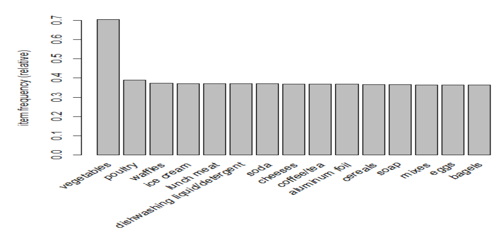
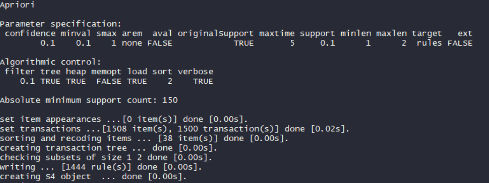
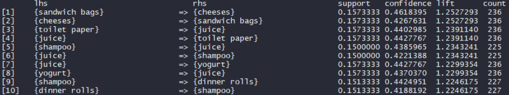
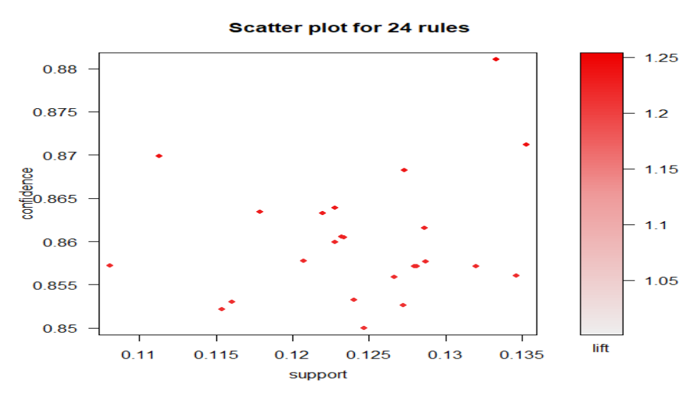
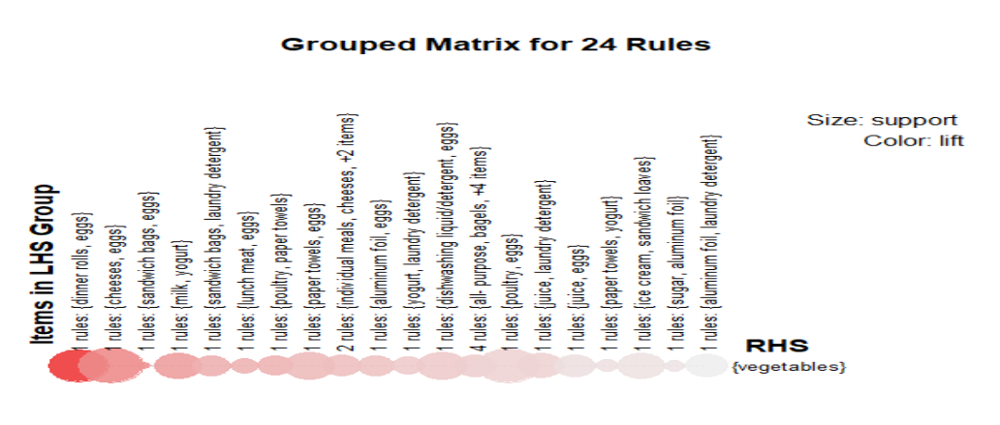
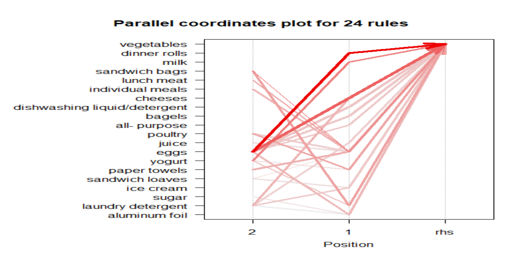
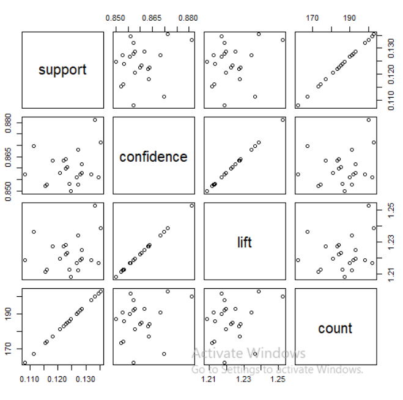
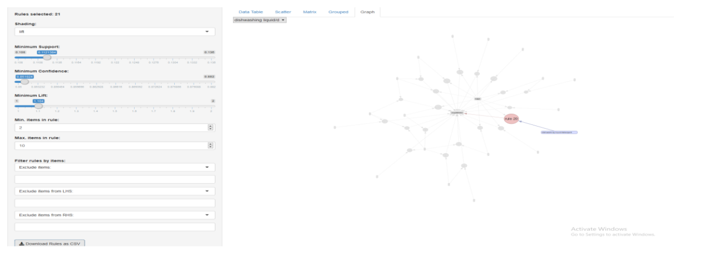

# Association Rules for supermarket dataset

The project consists of implementing Association Rules on a supermarket dataset with the purposes to detect patterns on customer transactions.

# Getting Started

- Download [https://code.visualstudio.com/] or another alternative source-code editor of your preference
- Download the project on [https://github.com/taxenco/Random-Forest-for-Predicting-Loan-Repayment-R.git].
- Go to your terminal and run the following command --> git clone https://github.com/taxenco/Random-Forest-for-Predicting-Loan-Repayment-R.git.
- Access to Visual Studio Code or another alternative source-code editor and open the project. Alternatively, you can access the project on through the terminal.
- Download R support for Visual Studio Code

# Prerequisites

- Visual Studio Code or another alternative source-code editor.
- Linux.
- R support for Visual Studio Code.
- Arules package [6]
- Able to read CSV files.

# Objective of the project

This project will implement a Association Rules on a supermarket dataset to find out patterns in customer's buying pattern.

# Theory on Association Rules

Association rules [1] are the result of searching data for patterns using metrics such as support,
confidence and lift to detect the most important relationships.

The association rules can show Novel and actionable associations. The interestingness of an
association is measured by Support, Confidence and lift. A significant confidence and support
threshold may show ‘Folklores’ or known facts, while a small support and confidence threshold
may show too many association rules that are not interesting.
The most common techniques used to search for patter within the dataset is the Apriori
technique [1]. The Apriori [3] technique for frequent itemset mining and association rules
learning. It aims to identify individual items in the dataset and extending them to larger sets.

Even though the Apriori is the most used method, we need to consider its advantages and
disadvantages.

Its advantages are that it uses large items property, it is easy parallelized, and it is easy to
implement. Contrary, It assumes transaction database is memory resident and requires up to
database scans.

# Data

The data selected is a supermarket basket. The dataset used was found on:

- https://www.kaggle.com/.

The dataset is made of 1499 rows and 35 columns. The rows are the transaction, and the columns correspond to the items
purchased.

Note: Find the original data on /Data/Online Retail.csv

# Data cleaning

In order to process the data in R, the first column had to fix the first column to separate the date from the item.

# Performing Association Rules

In this section will be performing association rules on the dataset using the Apriori algorithm
This technique aims to find ‘interesting’[1] relationship within the dataset. In order to detect
this association rules will perform an analysis with R.

An initial exploration of the data we can see that the most purchased item are Vegetables,
followed by Poultry, while the least is Bagels.

The Apriori algorithm was used to detect association rules. The thresholds were set very low
in order to have as many rules as possible and have a better picture of the associations.

As we can appreciate on the figure above that sets the support and confidence as low as 10% the
Apriori algorithm returns 1947 rules. Inspecting the top 10 rules, the Apriori returns the associations rules along with its support,
confidence and lift ordered by lift.

In order to be able to inspect the data, the Apriori algorithm has rerun setting the confidence at
85% to have fewer association rules and to be able to explore best rules and to be able to
visualize the graphs.

An interesting graph that shows us the rules distribution is the scatter plot. It maps the relation
between Confidence and Support.

The groups of Matrix show the association's rules found order by lifts. The colour of the lift
bubble represents the interestingness of the rule.

The parallel coordinates [5] allow the visualization the in a high-dimensional geometry and
analyzing multivariate data.

The association's rules parameters matrix shows an overview of the relationship among all the
parameters such as Support, Confidence lift and count.

Another exciting feature that R uses for Data exploration is the rule Explorer () function.

# Conclusion
The association rules are one of the most advanced techniques to find associations among items
in a dataset. Parameters such as confidence, support and lift assess the rules very well and may 
find out newness and actionability on the rules observed. 

However, even though Association Rules are a great tool to search for insight into a database. It needs from an
expert to find interestingness on the associations since the parameters are suitable for filtering
but need a quality assessment that only a human can do.

# Refences

- 1 - Associations Rules notes, Salford University. Dr.M Saraee.
- 2 - https://www.saedsayad.com/association_rules.htm
- 3 - https://en.wikipedia.org/wiki/Apriori_algorithm
- 4 - https://www.rdocumentation.org/packages/tidyr/versions/0.8.2/topics/separate
- 5 - https://en.wikipedia.org/wiki/Parallel_coordinates
- 6 - https://cran.r-project.org/web/packages/arules/arules.pdf
- 7 - https://blackboard.salford.ac.uk/bbcswebdav/pid-3341961-dt-content-rid-7430977_1/courses/SG-G500-M0141-T1-M-19/arulesViz.pdf

# Built With

- Linux - Operating system
- R programming language
- Arules package [6]
- CSV files

# Authors

- Carlos Beltran.

# Acknowledgments

The authors would like to thank Salford University.
