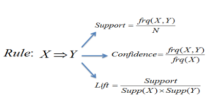
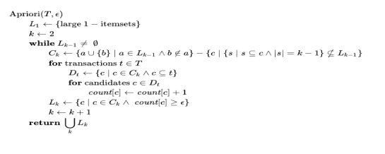
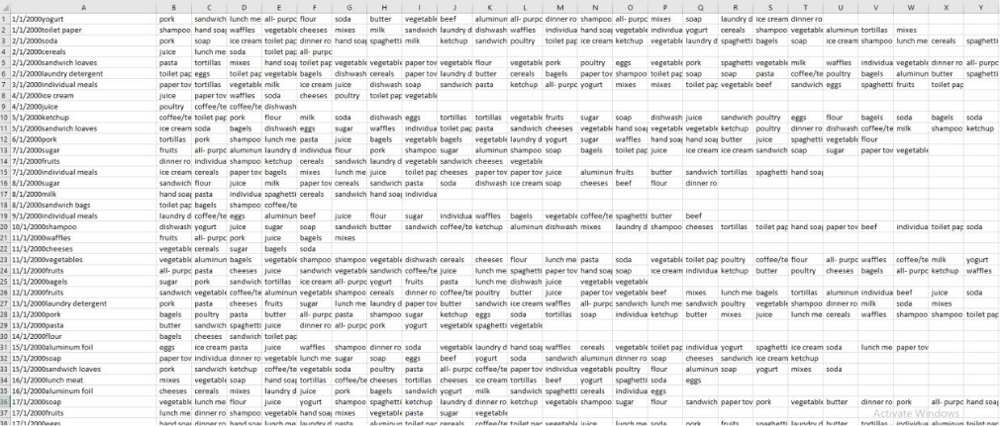
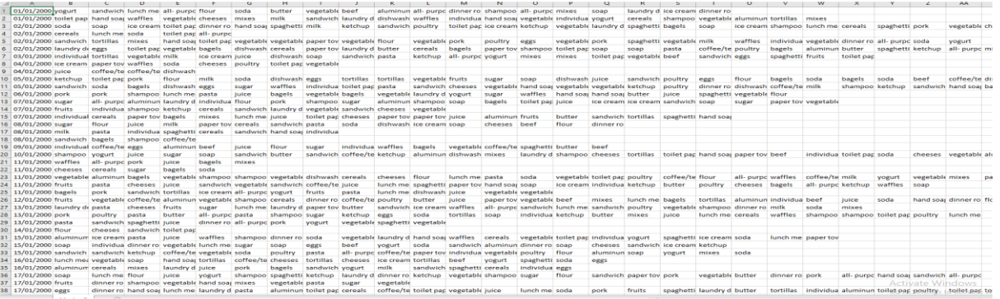

# Association Rules for supermarket dataset

The project consists of implementing Association Rules on a supermarket dataset with the purposes to detect patterns on customer transactions.

# Getting Started

- Download [https://code.visualstudio.com/] or another alternative source-code editor of your preference
- Download the project on [https://github.com/taxenco/Random-Forest-for-Predicting-Loan-Repayment-R.git].
- Go to your terminal and run the following command --> git clone https://github.com/taxenco/Random-Forest-for-Predicting-Loan-Repayment-R.git.
- Access to Visual Studio Code or another alternative source-code editor and open the project. Alternatively, you can access the project on through the terminal.
- Download R support for Visual Studio Code

# Prerequisites

- Visual Studio Code or another alternative source-code editor.
- Linux.
- R support for Visual Studio Code.
- Arules package [6]
- Able to read CSV files.

# Objective of the project

This project will implement a Association Rules on a supermarket dataset to find out patterns in customer's buying pattern.

# Theory on Association Rules

Association rules [1] are the result of searching data for patterns using metrics such as support,
confidence and lift to detect the most important relationships.

The association rules can show Novel and actionable associations. The interestingness of an
association is measured by Support, Confidence and lift. A significant confidence and support
threshold may show ‘Folklores’ or known facts, while a small support and confidence threshold
may show too many association rules that are not interesting.
The most common techniques used to search for patter within the dataset is the Apriori
technique [1]. The Apriori [3] technique for frequent itemset mining and association rules
learning. It aims to identify individual items in the dataset and extending them to larger sets.

Even though the Apriori is the most used method, we need to consider its advantages and
disadvantages.

Its advantages are that it uses large items property, it is easy parallelized, and it is easy to
implement. Contrary, It assumes transaction database is memory resident and requires up to
database scans.

# Data

The data selected is a supermarket basket. The dataset used was found on:

- https://www.kaggle.com/.

The dataset is made of 1499 rows and 35 columns. The rows are the transaction, and the columns correspond to the items
purchased.

All the variables are categorized as factors but Applicant Income, Loan Amount, Loan Amount
Term and, Credit History which is integers, and Co-applicant Income which is considered
numerical. The dependent variable is Loan status, the rest of the attributes are independent.

Note: Find the original data on /Data/Online Retail.csv

# Data cleaning

In order to process the data in R, the first column had to fix the first column to separate the date from the item.

# Performing classification Random Forest

# Refences

- 1 - Associations Rules notes, Salford University. Dr.M Saraee.
- 2 - https://www.saedsayad.com/association_rules.htm
- 3 - https://en.wikipedia.org/wiki/Apriori_algorithm
- 4 - https://www.rdocumentation.org/packages/tidyr/versions/0.8.2/topics/separate
- 5 - https://en.wikipedia.org/wiki/Parallel_coordinates
- 6 - https://cran.r-project.org/web/packages/arules/arules.pdf
- 7 - https://blackboard.salford.ac.uk/bbcswebdav/pid-3341961-dt-content-rid-7430977_1/courses/SG-G500-M0141-T1-M-19/arulesViz.pdf

# Built With

- Linux - Operating system
- R programming language
- Arules package [6]
- CSV files

# Authors

- Carlos Beltran.

# Acknowledgments

The authors would like to thank Salford University.
